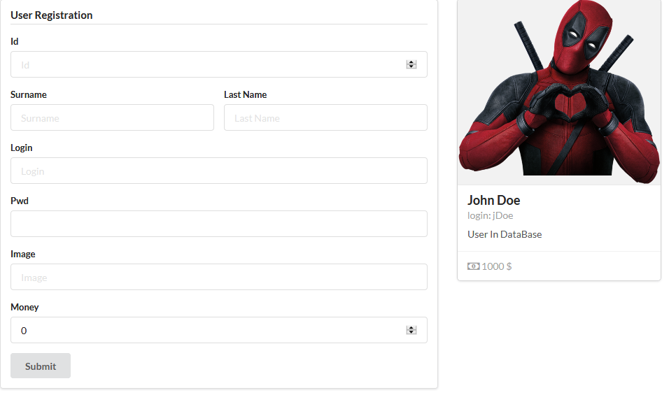

# Add A User Form




Add the following folder to the application **components/userform**.
Note: the UserForm component is a  simple atomic component that why we do not need to create additional folders such a components and containers
Create the **UserForm.jsx** file as follow:

```javascript
import React, { useState } from 'react';
import { Form, Header,Button } from 'semantic-ui-react'

export const UserForm = (props) =>{
       const [currentUser,setCurrentUser]= useState({
                                            id:"",
                                            surname:"",
                                            lastname:"",
                                            img:"",
                                            login:"",
                                            pwd:"",
                                            money:0,

                                        });

    function processInput(event, { valueData }){
        const target = event.currentTarget;
        const value = target.type === 'checkbox' ? target.checked : target.value;
        const name = target.name;
        console.log(event.target.value);
        let currentVal=currentUser;
        setCurrentUser({...currentUser, [name]: value});
        currentVal[name]= value;
        props.handleChange(currentVal);
    };

    function submitOrder(data){
        props.submitUserHandler(data);
    }
    
    return (
        <Form>
            <Header as='h4' dividing>
                User Registration
            </Header>
            <Form.Field>
                <Form.Input fluid type="number" label='Id' placeholder='Id' name="id" onChange={processInput} value={currentUser.id} />
            </Form.Field>
            <Form.Group widths='equal'>
                <Form.Input fluid label='Surname' placeholder='Surname' name="surname" onChange={processInput} value={currentUser.surname} />
                <Form.Input fluid label='Last Name' placeholder='Last Name' name="lastname"  onChange={processInput} value={currentUser.lastname}/>
            </Form.Group>

            <Form.Field>
                <Form.Input label="Login" placeholder="Login" onChange={processInput}  name="login" value={currentUser.login}/>
            </Form.Field>
            <Form.Field>
                <Form.Input type="password" label="Pwd" placeholder="" onChange={processInput}  name="pwd" value={currentUser.pwd}/>
            </Form.Field>
            <Form.Field>
                <Form.Input label="Image" placeholder="Image" onChange={processInput}  name="img" value={currentUser.img}/>
            </Form.Field>
            <Form.Field>
                <Form.Input label="Money" type="number" placeholder="" onChange={processInput}  name="money" value={currentUser.money}/>
            </Form.Field>
            <Button type='submit' onClick={submitOrder}>Submit</Button>
        </Form>

    );
    
    }
```
-   Code Explained:
    - `const [currentUser,setCurrentUser]= useState({id:""... });`: defines an empty user as state 

    - `props.handleChange(currentVal);`: the current UserForm component store callback functions of its parent.
    - ```<Form.Input fluid type="number" label='Id' placeholder='Id' name="id" onChange={processInput} value={currentUser.id} />``` : associates the current user state value to the input value `value={currentUser.id}`. On change on the input triggers the handleChange function `onChange={processInput}`.

    ```javascript
    function processInput(event, { valueData }){
            const target = event.currentTarget;
            const value = target.type === 'checkbox' ? target.checked :     target.value;
            const name = target.name;
            console.log(event.target.value);
            let currentVal=currentUser;
            setCurrentUser({...currentUser, [name]: value});
            currentVal[name]= value;
            props.handleChange(currentVal);
        };
    ```
    - When input value change occured, the associated user interaction event is collected. Input name and Input value are extracted (```event.currentTarget.name``` , ```event.currentTarget.value```). Then the current state is copy an updated with the current value. The current state is also updated. Afterall the updated user is transmitted to the callback function defined by the parent (```props.handleChange(currentVal);```).
    - Why we do not send directly the updated state like ```props.handleChange(this.state);``` ? Because the update of the current state is asynchrone ``` setCurrentUser({...currentUser, [name]: value});```, we have not the guarantee that when we call the parent callback function this.state has been updated.


# Update App.jsx

The new App.jsx looklike:
```javascript
import React, { useState } from 'react';
import { Grid, Segment } from 'semantic-ui-react'
import {User} from './components/user/containers/User'
import {UserForm} from './components/userform/UserForm'

//Create function component
export const App =(props) =>{
    const [currentUser,setCurrentUser]= useState({
                                        id:12,
                                        surname:"John",
                                        lastname:"Doe",
                                        login:"jDoe",
                                        pwd:"jdoepwd",
                                        img:'https://www.nicepng.com/png/full/982-9820051_heart-2352306885-deadpool-png.png',
                                        money:1000,
                                      });
     function callbackErr(data){
        console.log(data);
    };

    function handleChange(data){
      console.log(data);
      setCurrentUser({
        id:data.id,
        surname:data.surname,
        lastname:data.lastname,
        login:data.login,
        pwd:data.pwd,
        money:data.money,
        img:data.img,
      });
    };

    function submitUserHandler(data){
      console.log("user to submit"+data);
    };


    return (
      <Grid divided='vertically'>
        <Grid.Row columns={2}>
        <Grid.Column>

          <Segment>
          <UserForm 
                    handleChange={handleChange}
                    submitUserHandler={submitUserHandler}>
                </UserForm>
          </Segment>
        </Grid.Column>
        <Grid.Column>
            <User 
                   id={currentUser.id}
                    surname={currentUser.surname}
                    lastname={currentUser.lastname}
                    login={currentUser.login}
                    pwd={currentUser.pwd}
                    money={currentUser.money}
                    img={currentUser.img}>
            </User>
        </Grid.Column>
        </Grid.Row>
      </Grid>
    );
}
